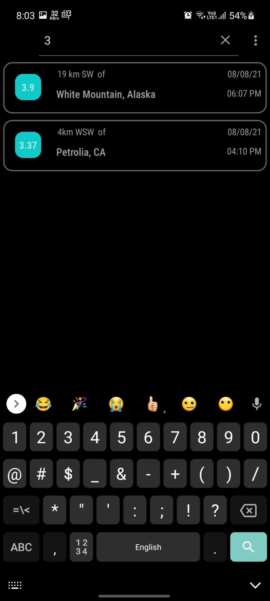
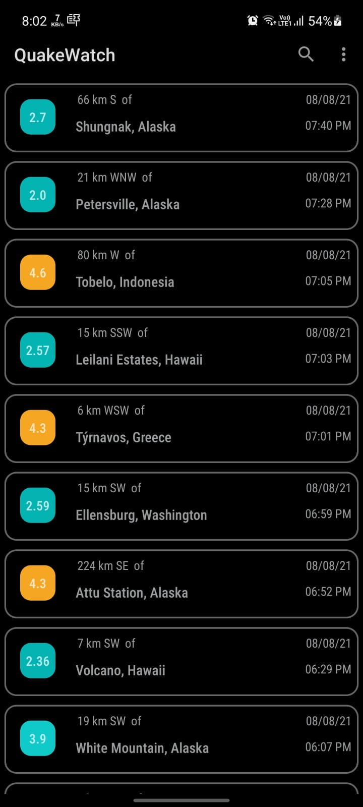
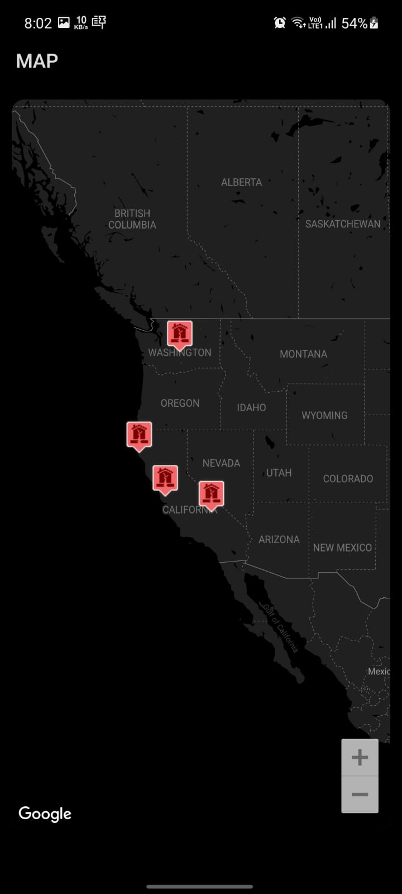
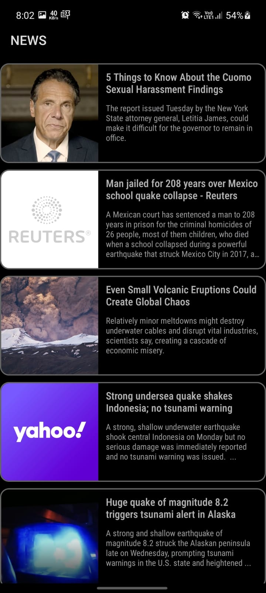

# QuakeWatch
Developed an Android App called QuakeWatch for users to monitor earthquakes happening around world.

### Highlights

* MAP implementation
* In-App WebBrowser
* USGS Earthquake API
* User can choose theme Light or Dark
* 7 different MAP themes are available
* Swipe down to refresh the earthquake data
* Swipe left to get NEWS feed about earthquakes
* Search feature, user can search earchquakes by country name or by magnitude

### MAP API 
You will need to register a Key for Google Map API for this project, go to API Console  
https://support.google.com/googleapi/answer/6158862?hl=en.  And then Use your API key as the value for google_maps_key in the strings.xml file under the res/values directory.

### USGS API
Fetched the real-time data in GeoJSON format from US Geological Survey Website 
https://earthquake.usgs.gov/fdsnws/event/1/

### NewsAPI
Using Free plan of NEWS API.  
You will need to regester to NEWSAPI to get API key and you can fetch news from NEWS API.  
https://newsapi.org/  

### Demo

https://youtu.be/tkJ9HHVNljM

